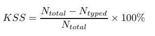

# Keyboard_Prediction
## Research statement
The prediction in the NLP task has  tasks of predicting the class, label, and POS tagging of the sentence. Word prediction, which predicts a word token, is also an important task. It is also possible to construct a word prediction model based on deep learning, but it is difficult to apply the RNN models to mobile devices due to the characteristics of models, which have a lot of computaion. However, a method to solve NLP task using CNN model with relatively low computational volume is being studied, and so I construct a word prediction model that can be operated on mobile devices based on CNN based model. In addition, new techniques such as ELMo and BERT  that can greatly enhance the performance of NLP tasks have emerged, and how to improve the performance of the new models using these techniques compared to old models. In addition, I want to check the degree of performance of Korean data and English data by using English and Korean data for each. Finally, we add frequency-based weight (simple conditional probability) to reflect the individual chat characteristics.

## Objectives
 - Achieved more than 40% based on Hit ratio metric
 - Recommended within 0.1s for each time step (Text input)
 - Performance comparison by various embedding techniques (Vanilla Word2vec, Fasttext, Glove, ELMo)
 - Performance comparison by various models (LSTM, CNN, Tree-based machine learning)

## Methodology
 Basically, I use the CNN model (Y Kim), but also compare the speed(time consumed) and performance of train and predict using vanilla LSTM model and tree-based machine learning model. It also reflects user experience information by adding a probability matrix based on the conditional probabilities (similar to the transition matrix of the Markov chain) before the softmax layer. This will mainly recommend the words (tokens) that user uses a lot.

>  In addition, when the model is input to CNN, the word-based filtering (vertical filter) rather than the word vector would be context-aware. I also have personal thoughts about this, and I want to do experiments on this method.

## Dataset
   - [Wikinews](https://github.com/Kyubyong/word_prediction)
   - [SNS_Collection](https://github.com/Meinwerk/WordPrediction)

## Metric
##### Keystroke saving rate

## Plan  

<del> ~ 11.16 : Data Preprocessing </del>  
<del> ~ 11.23 : Make embedding vectors </del>  
*\~ 11.26 : Experiment for LSTM model*   
*\~ 11.29 : Experiment for Machine Learning model*   
*\~ 12.5 : Experiment with ELMo*
*\~ 12.15 : Experiment for CNN*   
*12.16 ~ : Conclude*
